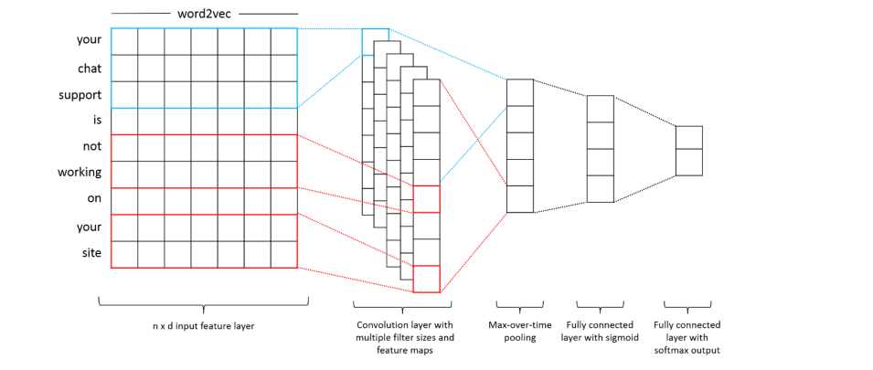
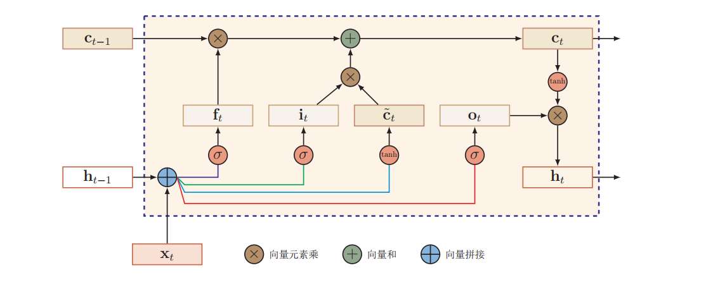
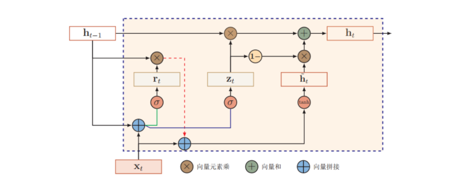

# Sentiment Analysis on Airline Tweet Reviews

[TOC]

## 摘要


## 1 引言

### 1.1 情感分析的相关发展

随着社交网络的发展，2010 年，以 twitter 为语料库，Alexander Pak, Patrick Paroubek 利用 N-gram 算法进行了情感分析和意见挖掘。他们构建了一个情感分类器，能够为文档确定积极，消极和中立的情感。实验评估表明，他们提出的技术是有效的，并且比先前提出的方法表现更好。在该研究中语言为英语，但是所提出的技术可以与任何其他语言一起使用。2011 年，Maite Taboada 和 Manfred Stede 等人提出语义定向计算器（SO-CAL）， 利用词语的情感强度以及情感加强和否定规则判断篇章的情感极性。

基于神经网络的语义组合算法被验证是一种非常有效的特征学习手段，2013 年，Richard Socher 和 Christopher Potts 等人提出多个基于树结构的 Recursive Neural Network，该方法通过迭代运算的方式学习变量长度的句子或短语的语义表示，在斯坦福情感分析树库（Stanford Sentiment Treebank）上验证了该方法的有效性。Nal Kalchbrenner 等人描述了一个卷积体系结构，称为动态卷积神经网络（DCNN），他们采用它来进行句子的语义建模。 该网络使用动态 k-Max 池，这是一种线性序列的全局池操作。 该网络处理不同长度的输入句子，并在句子上引入能够明确捕获短程和长程关系的特征图。 网络不依赖于解析树，并且很容易适用于任何语言。该模型在句子级情感分类任务上取得了非常出色的效果。

2015 年，Kai Sheng Tai，Richard Socher, Christopher D. Manning 在序列化的 LSTM （Long Short-Term Memory）模型的基础上加入了句法结构的因素，该方法在句法分析的结果上进行语义组合，在句子级情感分类和文本蕴含任务 (text entailment) 上都取得了很好的效果。

2016 年，Qiao Qian, Xiaoyan Zhu 等人在 LSTM 和 Bi-LSTM 模型的基础上加入四种规则约束，利用语言资源和神经网络相结合来提升情感分类问题的精度。

2017 年， Lotem Peled、Roi Reichart 尝试提出了简单的语句级标注模型，并尝试对情感词典、否定词和强度词的语言作用进行建模。结果表明，该模型能较好地反映情感词、否定词和强度词在情感表达中的语言作用。

2018 年， Wei Xue, Tao Li 等人提出了一种基于卷积神经网络和门控机制的模型，根据给定的方面或实体选择性地输出情感特征。该体系结构比现有模型中使用的注意层简单得多。其次，由于卷积神经网络没有时间依赖的特性，该模型计算可以在训练期间轻松并行化，并且门控单元也可以独立工作。 

### 1.2 研究 Twitter 情感分析的背景和意义

Twitter 是一个非常受欢迎的社交网站，用户在这里创建和互动的信息被称为 tweets。随着 Twitter 的用户群体不断扩大，Twitter 上的 tweets  成为各大公司或者其他组织从客户那里获得反馈的宝贵信息来源。营销人员通过使用不同方法对这些 tweets 进行情感分析，所得到的不同人群对某个实体所持的观点、态度、情感，能够有效地帮助他们提高相关的服务质量或产品质量，改进某方面的缺陷，甚至用作市场分析等等。

然而，由于数据规模非常庞大，且 tweets 在内容上往往显得比较随意杂乱，所以从语义学角度来对看似随机的评论中提取这些信息并非易事。不过随着技术的不断发展，机器学习领域的不断进步，我们有了更多更有效的工具来提高情感分析的准确性。

### 1.3 问题描述

Twitter 情感分析实际上属于自然语言处理领域中的文本情感分析任务，也可以被称为意见挖掘。在本报告中，我们将尝试使用不同的机器学习算法（包括传统机器学习的方法和深度学习的方法），通过喂入大量带情感极性标签的 tweets 数据，以监督学习的方式来训练良好的情感三分类器。这些情感三分类器对于给定的 tweets，能够较好地计算出 tweets 情感极性分别为积极，中立或者消极的概率，并选取概率最高的情感极性作为该 tweets 的最终预测情感极性。

### 1.4 论文结构简介

1. 论文第一部分是对 Twitter 情感分析的概述，这部分内容对 Twitter 情感分析的背景与意义进行了简要分析，同时介绍了本文所要完成的大致工作内容，包括建模方法与数据集来源；
2. 论文第二部分介绍本文所涉猎的模型，这部分内容对 1.3.2 中提及的模型进行了详细的解释并对每个模型进行了优缺点分析，为论文第四部分训练结果的评估提供有效的理论依据；
3. 论文第三部分阐述设计实验的过程，这部分内容包括数据集的预处理、训练模型的搭建、超参数的设定、模型的训练，为论文第四部分训练结果的评估提供实验数据支持；
4. 论文第四部分评估实验的结果，这部分内容对不同模型得到的结果进行对比与分析，同时深层次（包括时间利用率、空间利用率）对相应模型的优缺点进行归纳；
5. 论文第五部分是文章的总结与对未来文本情感分析发展的展望，这部分对文章完成的工作与解决的问题进行总结，同时也基于已完成的工作与当下情感分类问题的发展趋势对未来进行展望；
6. 论文第六部分是组内成员的自评与互评部分，这部分是每个人对自己本次论文中所完成的任务的总结以及对其他组员在本次论文中表现的评价。
7. 最后是参考文献以及致谢内容

----

## 2. 论文相关工作

在情感分析领域，目前有两种主流的方法可供我们进行使用，其分别为：

- 基于词典的方法和基于机器学习的方法，基于词典的方法涉及从文档中的单词或短语的语义方向计算文档的方向；
- 基于机器学习或深度学习的方法，基于机器学习或深度学习的方法涉及从文本或句子的标记实例中构建分类器，并且通常使用诸如 N-gram 之类的特征来训练情感分类器。

在本文中，我们着重对基于机器学习与深度学习的情感分类方法进行了探究，在设计实现单模型（传统机器学习模型、深度学习模型）并完成训练的基础上，也着手去尝试了完成多模型之间的融合工作。

#### 2.1 单模型训练

我们建立了各种不同的模型并进行训练，本文所涉猎的单模型有：朴素贝叶斯，线性支持向量机，K-近邻，因子分解机等传统机器学习模型，以及 TextCNN，RNN（LSTM，GRU）等深度学习模型。

在本项目中，我们使用了两类特征，对于传统机器学习模型，我们将使用 N-gram 特征来作为其特征输入，其中 N-gram 特征使用词频向量以及 TF-IDF 处理后的词频向量两种方法来分别进行实验；对于深度学习模型，我们将使用 Word2Vec 特征来作为其特征输入，其中 Word2Vec 特征使用预训练好的 300-d GloVe 词向量以及随机初始化的词向量两种方法来分别进行实验。

对于所有以上提及的模型，我们将比较模型之间的准确性，并分析模型的性能。

#### 2.2 多模型融合

我们使用了各种机器学习算法建立了各种不同的模型来进行情感分析，这给我们应用模型融合提供了条件。我们使用了准确率较高的前几个模型来进行模型融合，融合方式使用比较简单的 Majority Voting（多数投票法）。

----

### 3. 数据集与数据集特征选取

#### 3.1 数据集及其预处理

我们使用的数据集 [CrowdFlower 航空客户满意调查](https://www.crowdflower.com/wp-content/uploads/2016/03/Airline-Sentiment-2-w-AA.csv) 专注于美国主要航空公司的在 Twitter 上的评论，该数据集包含共 14640 条有关美国主要航空公司评论的有效推文，其中包含情感标签，推特内容以及其他元数据，如位置，用户 ID 等。数据分布约为 15% 的积极评论推文，65% 的消极评论推文，20% 的中性评论推文。我们将划分出其中的 80% 作为训练集，剩下 20% 作为测试集。

原始 tweets 数据通常比较嘈杂，比如包含转发推特（简称转推），表情符号，用户提及等特殊特征，需要适当地进行提取，因此，我们对数据集进行了大量的预处理步骤来规范化数据集，以减少数据脏乱带来的准确率上的影响。

---

#### 3.2 N-gram 

为了尽量保留词与词之间的关联性，N - gram 使用连续 N 个单词的组合作为数据的特征；例如，如果我们选择使用 2 - gram 特征，那么给定的句子 "This is a sunny day" ，会被拆分为一个词向量 ["This is","is a","a sunnt","sunny day"]；

从直观上来看，词向量中的部分特征，比如 “This is”，“sunny day” 很好地保持着单词之间的语义关联关系，可以帮助机器更好的理解所输入的句子。

N - gram 存在的问题集中在空间利用率上，在使用 N - gram 之前，一般需要对所有的文本进行处理，随后得到一个统一的基础向量，随后根据对应的句子的具体内容对该基础向量进行填 `1` 补充，某些长度过短的句子就可能出现向量中存在大量无用的 `0` 的情况，也就降低了空间利用率。

---

#### 3.3 Word2vec

Word2vec 是Tomas Mikolov 提出的用于单词表示学习的最先进的方法，其生成过程使用 了 Skip - Gram 和连续词袋模型。在 Word2vec 中，一个单词被表示为一个固定维度的实值向量，该实值向量可以充分保证单词之间的语言规律与语义关系。

类如，$V(king) - V(queen) ≈ V(man)$ ，V 在这里代表向量，同时 Word2vec 还具有一个优势，就是高频率出现的词汇之间在空间上的关联性会更高，而低频率词汇之间的关联性与之相对就会很低，这可以帮助我们降低文本处理过程中低频词汇对句子语义的影响。

Word2vec 存在的问题集中在多义词与代词的处理上，例如，“The rabbit is cute and it has two ears”，如果直接将这个句子进行 Word2vec 处理，那么该句子中的 `it` 就很难会被匹配为 `rabbit` 而仅仅只会被机器选择为代词 `it`。针对该问题，2017 年 ACL 最佳论文已经给出了解法，可以供后续的学习。

-----

## 4. 模型介绍

### 4.1 Naive Bayes

朴素贝叶斯（Naive Bayes）是分类问题中最为常见的机器学习算法之一。

朴素贝叶斯的思想基础是这样的：对于给定的待分类项，求解在此项出现的条件下各个类别出现的概率，哪个最大，就认为该待分类项属于哪个类别。在文本分类的情境下，所谓的待分类项可设为 $t=\{f_1, f_2, \cdots, f_n\}$ ，其中每个 $f_i$ 表示待分类项的一个特征分量，我们总共有类别集合 $C=\{c_1, c_2, \cdots, c_n\}$。按照朴素贝叶斯的思想，我们要做的就是计算 $P(c_1|t), P(c_2|t), \cdots, P(c_n|t)$ ，然后选出最大的那个，如果 $P(c_k|t)=max\{P(c_1|t), P(c_2|t), \cdots, P(c_n|t)\}$，那么 $t\in c_k$。由于 $t$ 具有 $n$ 维的特征，应用贝叶斯定理：
$$
P(c_k|t)=P(c_k|f_1,f_2,\cdots,f_n)=\frac{P(c_k)\cdot P(f_1|c_k)\cdot P(f_2|c_kf_1)\cdots P(f_n|c_kf_1\cdots f_{n-1})}{P(f_1,f_2,\cdots,f_n)}\\
$$
注意到分母 $P(f_1, f_2, \cdots, f_n)$ 对于任意类别 $c_i$ 都为常数，故我们只需要最大化分子即可。

朴素贝叶斯有一个非常简单但又重要的假设：“朴素地认为各个特征之间是相互独立互不相关的”，基于该假设， $P(c_k |t)$ 的分子部分可简化为 $P(c_k)\cdot P(f_1|c_k)\cdot P(f_2|c_k)\cdots P(f_n|c_k)$。

综上，待分类项 $t$ 被指定为类别 $\hat{c}$ 若：
$$
\hat{c}=\underset{c}{argmax}\ P(c|t)\\
P(c|t)\propto P(c)\prod^n_{i=1}P(f_i|c)
$$
此外，需要注意的是 $P(f_i|c)$ 在测试集上可能会出现为值为 0 的情况，因此我们还考虑到了加入一些平滑处理，这里使用的是拉普拉斯平滑（Laplace smoothing），又称为加一平滑（Add-one smoothing），其基本思想是保证每个 N-gram 在训练语料中至少出现一次。

-----

### 4.2 Linear Support Vector Machine

支持向量机（Support Vector Machine，常简称为 SVM）是一种监督式学习的方法，其广泛地应用于统计分类以及回归分析。这族分类器的特点是他们能够同时最小化经验误差与最大化几何边缘区，因此支持向量机也被称为最大边缘区分类器。

支持向量机的基本思想是这样的：在训练集中，对于每个待分类项 $t_i = \{f_1, f_2, \cdots, f_n\}$ ，我们有该待分类项的类别 $c_i$，支持向量机将待分类项 $t_i$ 映射到一个更高维的空间中，并期望在这个空间中找到一个超平面 $w\cdot t+b=0$，使得不同类别的待分类项位于超平面的两侧（$w\cdot t_i+b>0$ 或 $w\cdot t_i + b < 0$），符合要求的超平面显然不止一个，而 SVM 要做的就是找到一个最大分类间隔超平面。

在分开数据的超平面的两边建有两个互相平行的超平面，这两个超平面之间的距离实际上对应着所谓的分类间隔。分类间隔（margin）越大，那么分类器的总误差就越小。

综上，SVM 尝试解决的优化问题就是要优化分类间隔，记其为 $\gamma$，则有：
$$
\underset{w, \gamma}{max}\ \gamma,\ 
s.t.\ \forall i, \gamma \le c_i(w\cdot t_i+b)
$$
就超平面的概念而言，看起来似乎 SVM 适用于二分类问题而不太适用于多分类问题。事实上也确实如此，SVM 最初是为二分类问题设计的，当处理多分类问题时，我们需要额外做一些工作。

我们采用的策略是通过组合多个 SVM 二分类器来实现多分类器的构造，常见的方法有 one-vs-one 和 one-vs-rest 两种，这里我们使用后者，在训练时把某个类别的样本归为一类，其他剩余的样本归为另一类，这样 $k$ 个类别的样本就构造出了 $k$ 个 SVM。分类时将未知样本分类为既有最大分类函数值的那一类。

-----

### 4.3 K-nearest Neighbor

K-近邻（K-nearest Neighbors，简称 KNN）算法是基于实例的机器学习方法中最基本的一种学习方法，其既能用于分类也能用于回归。

K-近邻算法的基本思想很简单：给定一个包含大量实例的训练数据集，对于新的（来自测试集的）输入实例，在训练数据集中找到与该实例最邻近的 K 个实例，这 K 个训练集中的实例若多数都属于某个类 c，那么该新的输入实例就被指定为类 c。

要判断实例之间邻近与否，KNN 显然需要一个距离的度量，有很多距离度量方式可用，但最常用的是欧式距离，对于两个 $n$ 维的向量 $x$ 和 $y$，其二者的欧式距离定义为：
$$
D(x,y) = \sqrt{(x_1-y_1)^2 + (x_2-y_2)^2 + ... + (x_n-y_n)^2} = \sqrt{\sum\limits_{i=1}^{n}(x_i-y_i)^2}
$$
距离本身反映了实例之间的相似性。

-----

### 4.4 Factorization Machine

在传统的机器学习算法中，对自变量文本的处理都是先将其转为 One-Hot 向量，随后传入对应模型进行训练，但是训练集文本经过 One-Hot 编码之后，大部分 One - Hot 向量是比较稀疏的，也即每个 n 维特征，仅存在部分维度特征具有非零值的情况，一定程度上降低了空间利用率，并且原训练集数据特征与特征之间的关联程度无法被准确表示，比如当 n-gram = 1时候，对于短语 `in the morning` 会被拆分为三个单词，也就了失去原本应用的含义。

因子分解机（Factorization Machine，简称FM），又称分解机。是由德国康斯坦茨大学的Steffen Rendle（现任职于Google）于2010年最早提出的，旨在解决大规模稀疏数据下的特征组合问题，二阶FM 的表达式为：
$$
y(x)=w_0+\sum_{i=1}^nw_ix_i+\sum_{i=1}^n\sum_{j=i+1}^nw_{ij}x_ix_j
$$
其中，$n$ 代表样本的特征数量，$$x_i$$ 第 $$i$$ 个特征的值，$$w_0、w_i、w_{ij}$$ 是模型的参数。

然而，在数据稀疏性普遍存在的实际应用场景中，二次项参数的训练是很困难的。其原因是，回归模型的参数 $$w$$ 的学习结果就是从训练样本中计算充分统计量（凡是符合指数族分布的模型都具有此性质），而在这里交叉项的每一个参数 $$w_{ij}$$ 的学习过程需要大量的 $$x_i$$ 、$$x_j$$ 同时非零的训练样本数据。由于样本数据本来就很稀疏，能够满足 $$x_i$$ 和 $$x_j$$ 都非零的样本数就会更少。训练样本不充分，学到的参数 $$w_{ij}$$ 就不是充分统计量结果，导致参数 $$w_{ij}$$ 不准确，而这会严重影响模型预测的效果和稳定性，所以为了解决二次项训练的问题，引入了矩阵分解的思想，也即将所有二次项参数 $$w_{ij}$$ 组成一个对称矩阵 $$W$$ 那么这个矩阵就可以分解为 $$W=V^TV$$，$$V$$ 的第 $$j$$ 列便是第 $$j$$ 维特征的隐向量，也即每个参数 $$w_{ij}=⟨v_i,v_j⟩$$，所以原 FM 表达式可以写成： 
$$
y(x)=w_0+\sum _{i=1}^nw_ix_i+\sum_{i=1}^n\sum_{j=i+1}^n⟨v_i,v_j⟩x_ix_j
$$
其中，$$v_i$$ 是第 $$i$$ 维特征的隐向量，$$⟨⋅,⋅⟩$$ 代表向量点积，计算公式为： $$ ⟨v_i,v_j⟩=\sum_{f=1}^kv_{i,f}·v_{j,f} $$ 隐向量的长度为 $$k(k<<n)$$，包含 $$k$$ 个描述特征的因子，表达式前两项是线性回归模型的表达式，最后一项是二阶特征交叉项（又称组合特征项），表示模型将两个互异的特征分量之间的关联信息考虑进来，用交叉项表示组合特征，从而建立特征与结果之间的非线性关系；

FM 可以提升 One-Hot 向量特征之间的关联性，交叉项 $$⟨v_i,v_j⟩$$ 可以表示第 $i$ 项与第 $$j$$ 项之间的关联关系，如果交叉项结果为 0 ，则表示其没有关联关系，这样可以大大降低模型预测的错误率，提升模型的预估能力；

----

### 4.5 Text Convolutional Neural Networks（TextCNN）

卷积神经网络 (CNN) 是神经网络和卷积操作的结合，在卷积神经网络结构中，神经网络可以学习显式特征和隐藏特征之间的关系，卷子算子可以捕获特征中的局部区域信息。TextCNN作者针对一般文本分类任务，提出了一种具有两个通道和多个滤波器的CNN 网络，其结构如图：



TextCNN 第一层是输入层，对于每个句子或者段落，通过分词之后，将原句子按照顺序进行 word2vec 操作（这里可使用谷歌预训练向量，也可以规定最大长度随机生成向量），随后将这些词向量拼接生成特征矩阵，该特征矩阵每一行以相同的顺序对应于句子中的单词；第二层是卷积层，使用不同尺寸的多个滤波器对输入层进行卷积操作，在该层中，滤波器的长度要与特征向量的长度一致；第三层是随时间变化的最大池化层，该图层不会在上一层得到的局部向量中直接取最大值，而是对整个卷积层的结果取最大值；第四层是具有 sigmoid 函数的全连通隐藏层；第五层是具有 softmax 输出的全连接层。

TextCNN 的思想是：使用卷积层来捕获单词之间的局部特征（类似于 N-gram），使用两个全连接层来学习适合特定分类任务的高级特征，以及使用池化层防止过拟合操作与处理不同长度的文本数据。

-----

### 4.6 Long Short Term Memory

#### 4.6.1 LSTM 简介

$$LSTM(Long Short-Term Memory)$$，也即长短记忆网络，是循环神经网络的一个变体，可以有效的解决简单循环神经网络中的梯度消失或者梯度爆炸的问题。

$$LSTM$$ 引入一个新的内部状态 $$c_t$$ 专门进行线性的循环信息传递，同时输出信息给隐藏层的外部状态 $$h_t$$ ，$$LSTM$$ 的新计算方式为：
$$
\begin{aligned} \mathbf{c}_{t} &=\mathbf{f}_{t} \odot \mathbf{c}_{t-1}+\mathbf{i}_{t} \odot \tilde{\mathbf{c}}_{t} \\ \mathbf{h}_{t} &=\mathbf{o}_{t} \odot \tanh \left(\mathbf{c}_{t}\right) \end{aligned}
$$
其中$$f_t，i_t，o_t$$ 为三个门来控制信息传递的路径；$$\odot$$ 为向量元素乘积；$$c_{t-1}$$ 为上一时刻的记忆单元；$$\tilde{\mathbf{c}}_{t}$$ 是通过非线性函数得到的候选状态，其计算方法为：
$$
\tilde{\mathbf{c}}_{t}=\tanh \left(W_{c} \mathbf{x}_{t}+U_{c} \mathbf{h}_{t-1}+\mathbf{b}_{c}\right)
$$
在每个时刻 $$t$$，$$LSTM$$ 网络的内部状态 $$c_t$$ 记录了当前时刻为止的历史信息；

同时，$$LSTM$$ 引入了三个门，其分别为：

- 遗忘门 $$f_t$$ 控制上一个时刻的内部状态 $$c_{t-1}$$ 需要遗忘多少信息；
- 输入门 $$i_t$$ 控制当前时刻的候选状态 $$\tilde{\mathbf{c}}_{t}$$ 有多少信息需要保存；
- 输出门 $$o_t$$ 控制当前时刻的内部状态 $$c_t$$ 有多少信息需要输出给外部状态 $$h_t$$ ； 

三个门的计算方式为：
$$
\begin{aligned} \mathbf{i}_{t} &=\sigma\left(W_{i} \mathbf{x}_{t}+U_{i} \mathbf{h}_{t-1}+\mathbf{b}_{i}\right) \\ \mathbf{f}_{t} &=\sigma\left(W_{f} \mathbf{x}_{t}+U_{f} \mathbf{h}_{t-1}+\mathbf{b}_{f}\right) \\ \mathbf{o}_{t} &=\sigma\left(W_{o} \mathbf{x}_{t}+U_{o} \mathbf{h}_{t-1}+\mathbf{b}_{o}\right) \end{aligned}
$$
其中，$$\sigma(·)$$ 为 $$Logistic$$ 函数，$$x_t$$ 为当前时刻的输入，$$h_{t-1}$$ 为上一时刻的外部状态； 

#### 4.6.2 LSTM 的计算过程

$$LSTM$$ 循环单元结构的计算过程如下：

- 利用上一时刻的外部状态 $$h_{t-1}$$ 和当前时刻的输入 $$x_t$$ ，计算出三个门，以及候选状态 $$\tilde{\mathbf{c}}_{t}$$
- 结合遗忘门 $$f_t$$ 和输入门 $$i_t$$ 来更新记忆单元 $$c_t$$
- 结合输出门 $$o_t$$，将内部状态的信息传递给外部状态 $$h_t$$

转化为图示为：



----

### 4.7 Gated Recurrent Unit

#### 4.7.1 GRU 简介

门控循环单元（Gated Recurrent Unit， GRU）网络是一种比 LSTM 网络更加简单的循环神经网络; 和 LSTM 不同， GRU 不引入额外的记忆单元， GRU 网络引入一个更新门（Update Gate）来控制当前状态需要从历史状态中保留多少信息（不经过非线性变换），以及需要从候选状态中接受多少新信息，所以当前状态 $h_t$ 的更新过程可以记为 ：
$$
\mathbf{h}_{t}=\mathbf{z}_{t} \odot \mathbf{h}_{t-1}+\left(1-\mathbf{z}_{t}\right) \odot g\left(\mathbf{x}_{t}, \mathbf{h}_{t-1} ; \theta\right)
$$
其中 $\mathbf{z}_{t} \in[0,1]$ 为更新门，其表达式为：
$$
\mathbf{z}_{t}=\sigma\left(\mathbf{W}_{z} \mathbf{x}_{t}+\mathbf{U}_{z} \mathbf{h}_{t-1}+\mathbf{b}_{z}\right)
$$
在 LSTM 网络中，输入门和遗忘门是互补关系，具有一定的冗余性；GRU网络直接使用一个门来控制输入和遗忘之间的平衡。

#### 4.7.2 GRU 计算过程

从 $$h_t$$ 表达式中可知，当 $$z_t = 0$$时，当前状态 $$h_t$$ 和前一时刻的状态 $$h_{t-1}$$ 之间为非线性函数关系；当$$z_t = 1$$ 时， $$h_t$$ 和 $$h_{t-1}$$ 之间为线性函数关系；

在 GRU 网络中， 函数 $g\left(\mathbf{x}_{t}, \mathbf{h}_{t-1} ; \theta\right)$ 定义为:
$$
\tilde{\mathbf{h}}_{t}=\tanh \left(W_{h} \mathbf{x}_{t}+U_{h}\left(\mathbf{r}_{t} \odot \mathbf{h}_{t-1}\right)+\mathbf{b}_{h}\right)
$$
其中 $\tilde{\mathbf{h}}_{t}$ 表示当前时刻的候选状态， $$\mathbf{r}_{t} \in[0,1]$$ 为重置门，用来控制候选状态 $\tilde{\mathbf{h}}_{t}$ 的计算是否以来上一时刻的状态 $h_{t-1}$ ，其中 $$r_t$$ 的表达式为：
$$
\mathbf{r}_{t}=\sigma\left(W_{r} \mathbf{x}_{t}+U_{r} \mathbf{h}_{t-1}+\mathbf{b}_{r}\right)
$$
当 $$r_t = 0$$ 时，候选状态 $$\tilde{\mathbf{h}}_{t}=\tanh \left(W_{c} \mathbf{x}_{t}+\mathbf{b}\right)$$ 只和当前输入 $x_t$ 相关，和历史状态无关；当 $$r_t = 1$$ 时，候选状态 $$\tilde{\mathbf{h}}_{t}=\tanh \left(W_{h} \mathbf{x}_{t}+U_{h} \mathbf{h}_{t-1}+\mathbf{b}_{h}\right)$$ 和当前输入 $$x_t$$ 和历史状态 $$h_{t-1}$$ 相关，和简单循环网络一致;

以上计算过程可转化为图示：



----

## 5. 实验过程与实验结果

由于本文涉及多个模型，在描述实验的过程中可能会存在诸如变量名冲突等问题，所以该部分按第四部分中的模型顺序对不同的实验过程进行描述，保证变量名的不冲突性以及表达式的不冲突性，同时在该部分的最后，我们对实验的所有结果进行汇总，并以表格的形式进行展示。

针对传统机器学习算法，在搭建模型部分选择使用 **sklearn** 给出的库函数，给出的超参数则是作用于数据的预处理部分；针对基于深度学习的算法，在搭建模型部分选择基于 **Pytorch** 的框架进行模型搭建工作，给出的超参数则是作用于深度学习模型的训练过程使用到的 `batchsize` 、`Lr` 等数据。

### 5.1 Naive Bayes

在朴素贝叶斯方法中，对输入变量的处理基于 N - gram 方法，也即将输入的文本进行向量化，在原有数据处理结果的基础上移除了输入的句子中出现的频率太高或者出现次数太少的单词，这样就可以保证输入变量对应的 N - gram 词向量不会受到极端数据的影响；

**sklearn** 已提供可使用的朴素贝叶斯模型函数 `MultinomialNB()`，而数据预处理涉及到的超参数则如下表：

| Parameter | Range                 |
| --------- | --------------------- |
| min-df    | 0 , 1 , 2 , 3 , 5 , 7 |
| max-df    | 0.5, 0.7 , 0.9, 1.0   |
| N-gram    | 1 , 2 , 3             |

相关变量解释：

- $min-df$ 代表词出现次数的下界；
- $max-df$ 代表某个单词出现的最高频率；
- $N$  代表 N - gram 中相邻单词的个数；

经过多次的重复实验，最终可以得出超参数的最优选择，也即：

```bash
min-df = 7
max-df = 0.5
N = 1
```

### 5.2 Linear Support Vector Machine

在线性支持向量机方法中，我们使用具有铰链损失的线性支持向量机，并通过一对一的方法将多分类问题转化为二分类问题，即对于每个类训练都有一个将其与其他训练分离的模型；

**sklearn** 已提供可使用的线性支持向量机模型函数 `LinearSVC()`，而数据预处理涉及到的超参数则如下表：

| Parameter | Range                        |
| --------- | ---------------------------- |
| min-df    | 0 , 1 , 2 , 3 , 5 , 7        |
| max-df    | 0.5, 0.7, 0.9, 1.0           |
| N-gram    | 1 , 2 , 3                    |
| C         | 0.01, 0.03, 0.05, 0.07, 0.09 |

相关变量解释：

- $C$ 代表支持向量机中的偏置项；

经过多次的重复实验，最终可以得出超参数的最优选择，也即：

```bash
min-df = 0
max-df = 1.0
N = 1
C = 0.03 
```

### 5.3 K-means

给定一个包含大量实例的训练数据集，k-mean模型对于新的（来自测试集的）输入实例，在训练数据集中找到与该实例最邻近的 K 个实例，这 K 个训练集中的实例若多数都属于某个类 c，那么该新的输入实例就被指定为类 c。

**sklearn** 已提供可使用的 **k-means** 模型函数 `KNeighborsClassifier()`，而数据预处理涉及到的超参数则如下表：

| Parameter   | Range                 |
| ----------- | --------------------- |
| min-df      | 0 , 1 , 2 , 3 , 5 , 7 |
| max-df      | 0.5, 0.7, 0.9, 1.0    |
| N-gram      | 1 , 2 , 3             |
| n_neighbors | 10, 20, 30, 40        |

经过多次的重复实验，最终可以得出超参数的最优选择，也即：

```bash
min-df = 1
max-df = 0.9
N = 1
n_neighbors = 30
```

### 5.4 Factorization Machine

从 `4.4` 的推导过程中可以看出，因子分解机模型是线性分类模型改进，其在线性分类模型基础上增加了表示单词之间关联关系的计算项，并通过不断的训练完成对系数稀疏矩阵的更新，完成对情感极性的预测。

搭建因子分解机模型的过程不算复杂，首先需要创建一个简单的线性分类器 `Linear()`并规定其输出结果为一个 $1×3$  的向量，随后创建一个用于表示句子单词之间相互关系的交互矩阵；

将经过处理之后的输入文本向量传入第一层的线性分类器，得到相应结果；随后将第一层得到的结果传到第二层与交互矩阵做乘积并且计算每一项的平方值，得到相应结果；将第二层得到的结果进行平方，同时将第一层得到的结果进行平方，随后将二者做乘积得到第三层的结果，拿到上述这些结果，根据因子分解机表达式进行计算，求出损失值并完成对模型中参数的更新。

因子分解机模型涉及到的超参数如下，变量含义同朴素贝叶斯模型中的设定：

| Parameter | Range                 |
| --------- | --------------------- |
| min-df    | 0 , 1 , 2 , 3 , 5 , 7 |
| max-df    | 0.5, 0.7, 0.9, 1.0    |
| N-gram    | 1 , 2 , 3             |

经过多次的重复实验，最终可以得出超参数的最优选择，也即：

```bash
min-df = 1
max-df = 0.9
N = 1
```

### 5.5 TextCNN

TextCNN 使用词嵌入向量（一般向量的长度为 300 维）作为输入，该向量既可以是谷歌的预训练词嵌入向量，也可以是根据输入变量的语料库自行随机生成的词嵌入向量；由于 word2vec 可以很好的表示单词之间的关联关系，也即可以保证卷积神经网络可以很好的提取到原句子的数据特征，最大化的减少输入信息的缺失情况。

搭建TextCNN 模型，首先需要创建一个词嵌入层，完成对长度为 $N$ 的句子的处理，进而得到对应的词嵌入矩阵；将得到的词嵌入矩阵进行卷积处理，这一步为了可以尽量提取到数据的特征，可以选择使用不同大小的卷积核；在完成卷积处理之后，将每个卷积处理得到的结果传入 `max-pool` 层，得到结果之后进行全连接操作，最后经过 `softmax` 函数，得到最终的分类结果，并计算损失值完成对卷积神经网络层参数的更新。

TextCNN 模型涉及到的超参数来自模型的训练过程：

| Parameter | Range                         |
| --------- | ----------------------------- |
| batchsize | 16, 32, 64, 128, 256          |
| LR        | 0.01 , 0.005 , 0.0025 , 0.001 |
| word_dim  | 100 , 200 , 300               |
| epoch     | 2, 3, 4, 5                    |
| kfold     | 3, 5, 10                      |

相关变量解释：

- $batchsize$ 模型训练的批量大小
- $LR$ 代表模型的学习率
- $word\_dim$ 代表词嵌入向量的长度
- $epoch $ 每个 $fold$ 中的训练次数
- $kfold$ 交叉验证折数

经过多次的重复实验，最终可以得出超参数的最优选择，也即：

```bash
batchsize = 16
LR = 0.001
word_dim = 300
epoch = 2
kfold = 5
```

### 5.6 LSTM

LSTM 模型基于传统的 RNN 模型引入了门限机制，其对输入变量时间上的依赖关系进行了规则限定，在完成一系列的计算之后，产生一个输出单元序列用于完成对应的任务。

搭建 LSTM 模型，首先需要创建一个词嵌入层，将输入的文本变量转换为一个词嵌入矩阵；完成输入文本的处理之后，将词嵌入矩阵传入 LSTM 层中进行串行计算，最后将得到的隐藏层结果传入到 `softmax` 函数，得到最终分类结果，计算损失值并完成对模型参数的更新，

LSTM 模型涉及到的超参数来自模型的训练过程：

| Parameter | Range                                |
| --------- | ------------------------------------ |
| batchsize | 16, 32, 64, 128, 256                 |
| LR        | 0.01 , 0.005 , 0.0025 , 0.001, 0.002 |
| word_dim  | 100 , 200 , 300                      |
| epoch     | 2, 3, 4, 5                           |
| kfold     | 3, 5, 10                             |

经过多次的重复实验，最终可以得出超参数的最优选择，也即：

```bash
batchsize = 16
LR = 0.002
word_dim = 300
epoch = 2
kfold = 3
```

### 5.7 GRU

GRU 模型与 LSTM 模型机制基本相同，唯一不同在于 GRU 模型单个运算单元中使用一个门限机制代替LSTM 模型单个运算单元中遗忘门与输出门的功能。

LSTM 模型涉及到的超参数来自模型的训练过程：

| Parameter | Range                         |
| --------- | ----------------------------- |
| batchsize | 16, 32, 64, 128, 256          |
| LR        | 0.01 , 0.005 , 0.0025 , 0.001 |
| word_dim  | 100 , 200 , 300               |
| epoch     | 2, 3, 4, 5                    |
| kfold     | 3, 5, 10                      |

经过多次的重复实验，最终可以得出超参数的最优选择，也即：

```bash
batchsize = 16
LR = 0.002
word_dim = 300
epoch = 2
kfold = 3
```

### 5.8 实验结果汇总

对所有模型运行十次的情感分类准确率结果取平均值并进行统计，下表统计结果的具体数值：

| 模型名称                         | 准确率     |
| -------------------------------- | ---------- |
| Naive bayes                      | 77.21994 % |
| Naive bayes（含TF-IDF）          | 76.43078 % |
| Linear SVM                       | 81.01092 % |
| Linear SVM（含TF-IDF）           | 81.28415 % |
| K-means                          | 53.34153 % |
| K-means（含TF-IDF）              | 75.40072 % |
| FM                               | 80.98024 % |
| FM（含TF-IDF）                   | 80.99145 % |
| TextCNN                          | 79.35862 % |
| TextCNN（使用 GloVe 预训练向量） | 81.45012 % |
| LSTM                             | 79.63568 % |
| LSTM（使用 GloVe 预训练向量）    | 81.51456 % |
| GRU                              | 79.9535 %  |
| GRU（使用谷歌预训练向量）        | 82.12872 % |
| 模型融合                         | 82.51685 % |

根据实验结果中各模型的表现，可以看到 GRU，LSTM，SVM，TextCNN，SVM 的表现位列前五且准确率比较接近，都基本在 81% 以上，故选取这 5 个模型的预测结果采用 Majority Voting 的形式进行简单地模型融合。举个简单的 Majority Voting 的例子，对于某个句子输入，如果 SVM，TextCNN 预测的情感极性为 neutral，而 FM，LSTM，GRU 预测的情感极性为 negative，那么对于输入句子情感极性为 neutral 的投票数为 2，为 negative 的投票数为 3，那么最终将指定 negative 为该句子的情感极性，也即，获得最多投票的情感极性将作为句子的最终情感极性。采用 Majority Voting 进行模型融合后，准确率略有改进，突破到了 82.5%。

针对传统机器学习模型的数据结果，其准确率有限的原因：

- 一方面在于传统机器学习模型受限于输入变量对原文本信息的捕捉， 在前文中我们介绍过 N - gram 的工作原理，针对某一句具体的话，机器无法准确识别单词与单词之间的关联关系，一旦某个关联关系被破坏，那么很有可能就会导致我们得到的词向量并不能准确的反应原句子的含义，这也就会大大的影响我们做分类的最终准确率； 
- 另一方面在于传统机器学习模型对多数据样本的适应能力有限，类如 SVM 模型，SVM 模型是基于线性分类模型的改进而产生的，有限的变量关联关系并不能很好的提取出数据的部分特征，这就导致即使我们无穷次的适应训练样本数据，也不能保证模型的泛化效果。

针对深度学习模型的数据结果，其准确率有限的原因：

- 一方面在于对模型训练次数的过多导致模型对训练集的过拟合，过拟合现象一旦出现，即使训练过程中的损失值降到很小，也会有测试集误差特别大的情况；所以，如何防止模型的过拟合，是深度学习模型在训练过程中需要处理的一个很重要的问题；在本文所涉及的深度学习模型训练过程中，首先分离出了一部分训练集的数据作为验证集数据用于检验模型的误差值，当误差值出现上升的情况时就终止模型的训练，防止模型的过拟合。
- 另一方面在于样本数据数目的限制，一个完备可用的深度学习模型必须是要对多种数据都有极强的泛化能力，而这又需要模型要广泛学习多类别数据的特征，本文使用的数据集只有 10000 多条，远远达不到模型泛化的要求，所以数据数目也是影响深度学习模型泛化能力的一个重要原因。

## 6. 总结与展望

### 6.1 情感分析的瓶颈

- 现在的情感分析工作已经能够完成一些简单的任务，并表现出机器具有识别人类情感的能力，但是这些任务的复杂度还不足以与实际应用中任务的复杂度匹配。
- 情感分析的研究需要词典资源的支持，特别是在中文领域，目前的词典的质和量都还有提高的空间，并且还需要更多的主客观词典.
- 在情感表达形式上，人们对于情感的表达也多样化的，有直截了当的，也有含蓄不露的，更有通过修辞手段及反讽的多种形式表达情感，因此需要更深层次的机器学习技术以及情感常识库的支持，如何构建常识知识库是亟待解决的问题。

### 6.2 情感分析的未来发展方向

- 在情感研究对象上，随着应用领域的不断扩展，情感对象从之前的对产品、服务等的褒贬倾向性评论到对社交媒体中的用户、话题情绪分类，表现形式更加多样，情感种类更加繁多，研究的内容也会发生相应转变，包括更加关注用户的信息以及针对社交媒体中事件用户情感的变迁。
- 在情感分析学习算法上，深度学习的崛起，无疑也为情感分析中的许多任务提供了良好的工具，并在一些任务上初现端倪，随着情感分析研究不断扩展和深入，会发挥更多的作用。
- 从认知科学角度，情感分析是人工智能的一部分，虽然尚不能完全了解人类情感产生的机理，但是可以和认知科学研究者开展合作研究，通过观察脑电波探知产生各种情感的脑波形和反射情况，为情感分析研究提供科学依据。
- 在情感分析应用上，情感分析和人工智能结合，将产生一系列的应用，在聊天机器人中识别用户情感，并给予情感抚慰。更进一步，未来情感分析应用于对文章及诗词的鉴赏，自动生成自己的观点、立场及情绪，表达机器自身的情感，从而向强人工智能迈进。

----

## 7. 个人项目总结与互评

个人在这次项目中，完成了报告的撰写与部分代码模型的设计与实现工作，总的来说是把基础的用于情感分析的传统机器学习模型与深度学习模型重新实现了一遍，也算是对这半年在实验室进行自然语言处理工作的一个回顾。

整体来说，模型的搭建与实现并不算困难，但是把已经完成的工作转成可视化的文字描述还是遇到了许多问题，比如英文到中文的转述，有些单词直接翻译就不能很好的表示原先的含义，同时在时间上的分配，也是自己以后需要注意的。


## 参考文献

## 致谢