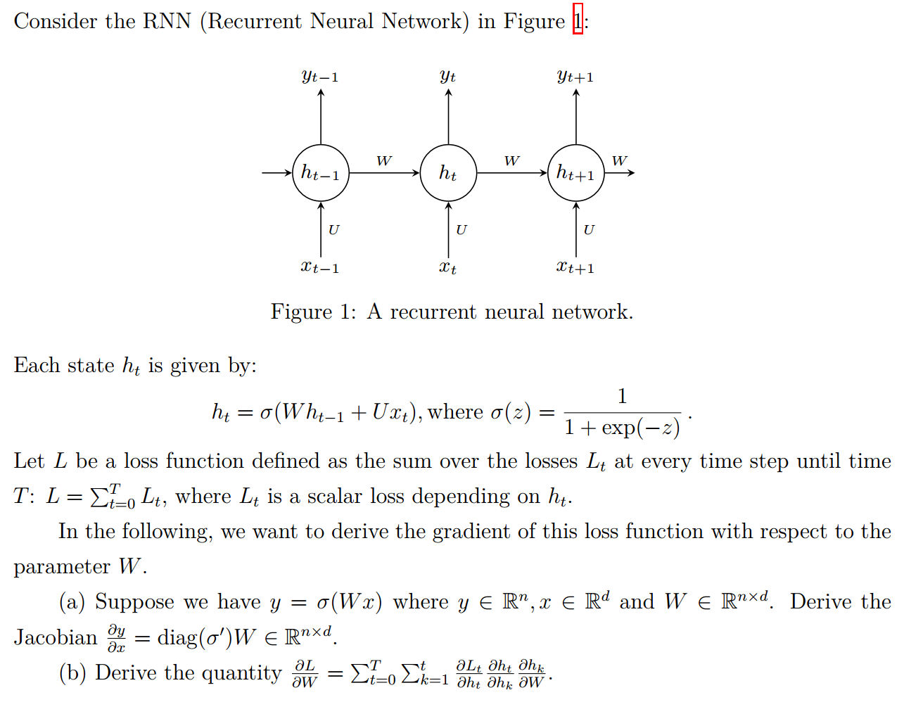

## Homework 3: Recurrent Neural Networks

`16340237 吴聪`

### Exercise 1: Backpropagation through Time 

#### Part (a) of Ex.1 

$y=\sigma(Wx)$ where $y\in R^n$，$x\in R^d$ and $W\in R^{n\times d}$，应用链式法则有
$$
\begin{align}
\frac{\partial{y}}{\partial{x}}=
\frac{\partial{\sigma{(Wx)}}}{\partial{x}}=
\frac{\partial{\sigma{(Wx)}}}{\partial{Wx}}\frac{\partial{Wx}}{\partial{x}}
\tag{1}
\end{align}
$$
为简化表示，设 $o=Wx$，则 $o\in R^n$: 
$$
\begin{align}
Wx
&=\begin{bmatrix}
w_{11} & w_{12} & ... & w_{1d}\\
w_{21} & w_{22} & ... & w_{2d}\\
w_{31} & w_{32} & ... & w_{3d}\\
&.\\&.\\
w_{n1} & w_{n2} & ... & w_{nd}\\
\end{bmatrix}
\begin{bmatrix}
x_{1}\\
x_{2}\\
.\\.\\
x_{d}\\
\end{bmatrix}
=\begin{bmatrix}
w_{11}x_1 + w_{12}x_2 + ... + w_{1d}x_d\\
w_{21}x_1 + w_{22}x_2 + ... + w_{2d}x_d\\
w_{31}x_1 + w_{32}x_2 + ... + w_{3d}x_d\\
.\\.\\
w_{n1}x_1 + w_{n2}x_2 + ... + w_{nd}x_d\\
\end{bmatrix}
=\begin{bmatrix}
o_{1}\\
o_{2}\\
o_{2}\\
.\\.\\
o_{n}\\
\end{bmatrix}
=o
\tag{2}
\end{align}
$$

$$
\begin{align}
o_i=w_{i1}x_1+w_{i2}x_2+...+w_{id}x_d, && i=1,2,...,n
\tag{3}
\end{align}
$$

对于 $\frac{\partial{Wx}}{x}$，根据式 (3) 有 $\frac{\partial{Wx}}{x}=W$：
$$
\begin{align}
\frac{\partial{Wx}}{\partial x}=\frac{\partial{o}}{\partial x}
&=\begin{bmatrix}
\frac{\partial{o_1}}{\partial x_1} & \frac{\partial{o_1}}{\partial x_2} & ... & \frac{\partial{o_1}}{\partial x_d}\\
\frac{\partial{o_2}}{\partial x_1} & \frac{\partial{o_2}}{\partial x_2} & ... & \frac{\partial{o_2}}{\partial x_d}\\
&.\\&.\\
\frac{\partial{o_n}}{\partial x_1} & \frac{\partial{o_n}}{\partial x_2} & ... & \frac{\partial{o_n}}{\partial x_d}\\
\end{bmatrix}\tag{4}\\
&=\begin{bmatrix}
w_{11} & w_{12} & ... & w_{1d}\\
w_{21} & w_{22} & ... & w_{2d}\\
&.\\&.\\
w_{n1} & w_{n2} & ... & w_{nd}\\
\end{bmatrix}\tag{5}\\
&=W\tag{6}
\end{align}
$$
对于 $\frac{\partial{\sigma{(Wx)}}}{\partial{Wx}}$，根据式 (7) 有 $\frac{\partial{\sigma{(Wx)}}}{\partial{Wx}}=diag(\sigma^{′ })$：
$$
\begin{align}
y_i = \sigma{(o_i)},&& i=1,2,...,n
\tag{7}
\end{align}
$$

$$
\begin{align}
\frac{\partial{\sigma{(Wx)}}}{\partial{Wx}}=\frac{\partial{y}}{\partial{o}}
&=\begin{bmatrix}
\frac{\partial{y_1}}{\partial{o_1}}& \frac{\partial{y_1}}{\partial{o_2}}& ...&  \frac{\partial{y_1}}{\partial{o_n}}\\
\frac{\partial{y_2}}{\partial{o_1}}& \frac{\partial{y_2}}{\partial{o_2}}& ...&  \frac{\partial{y_2}}{\partial{o_n}}\\
&.\\&.\\
\frac{\partial{y_n}}{\partial{o_1}}& \frac{\partial{y_n}}{\partial{o_2}}& ...&  \frac{\partial{y_n}}{\partial{o_n}}\\
\end{bmatrix}\tag{8}\\
&=\begin{bmatrix}
\sigma'(o_1) & 0 & ... & 0\\
0 & \sigma'(o_2) & ... & 0\\
&.\\&.\\
0 & 0 & ... & \sigma'(o_n)\\
\end{bmatrix}\tag{9}\\
&=diag(\sigma')\tag{10}
\end{align}
$$

综上 (1) (6) 和 (10) 可得
$$
\begin{align}
\frac{\partial{y}}{\partial{x}}=
\frac{\partial{\sigma{(Wx)}}}{\partial{x}}=
\frac{\partial{\sigma{(Wx)}}}{\partial{Wx}}\frac{\partial{Wx}}{\partial x}=
diag(\sigma')W\in R^{n\times d}\tag{11}
\end{align}
$$

#### Part (b) of Ex.1 

由题可知，$L$ 被定义为在每个 time step 上的损失 $L_t$ 的和（time step 从 0 开始）：
$$
\begin{align}
L=\sum^{T}_{t=0}L_t\tag{12}
\end{align}
$$

对于 $\frac{\partial{L}}{\partial{W}}$，根据式 (12) 有：
$$
\begin{align}
\frac{\partial{L}}{\partial{W}}=\frac{\partial{}}{\partial{W}}\sum^T_{t=0}L_t=\sum^T_{t=0}\frac{\partial{L_t}}{\partial{W}}\tag{13}
\end{align}
$$
对于 $\frac{\partial{L_t}}{\partial{W}}$，由题可知，$L_t$ 是与 $h_t$ 相关的一个标量损失值，而 $h_t=\sigma{(Wh_{t-1}+Ux_t)}$ 且 $h_{t-1}=\sigma{(Wh_{t-2}+Ux_{t-1})}$，其中 $h_{t-1}$ 也和 $W$ 有关，同理，递推下去，$h_{t-2}, h_{t-3}, \cdots, h_1, h_0$ 也和 $W$ 有关（此外还有一个初始化用于计算 $h_0$ 的 $h_{init}$，$h_{0}=\sigma(Wh_{init}+Ux_{0})$，$h_{init}$ 和 $W$ 没有关系），所以应用链式法则有：
$$
\begin{align}
\frac{\partial{L_t}}{\partial{W}}&=(\frac{\partial{L_t}}{\partial{h_t}}\frac{\partial{h_t}}{\partial{W}})+(\frac{\partial{L_t}}{\partial{h_t}}\frac{\partial{h_t}}{\partial{h_{t-1}}}\frac{\partial{h_{t-1}}}{\partial{W}})+\cdots+(\frac{\partial{L_t}}{\partial{h_{t}}}\frac{\partial{h_t}}{\partial{h_{t-1}}}\cdots\frac{\partial{h_3}}{\partial{h_{2}}}\frac{\partial{h_2}}{\partial{W}})+(\frac{\partial{L_t}}{\partial{h_{t}}}\frac{\partial{h_t}}{\partial{h_{t-1}}}\cdots\frac{\partial{h_2}}{\partial{h_{1}}}\frac{\partial{h_1}}{\partial{W}})\tag{14}\\
&=
(\frac{\partial{L_t}}{\partial{h_t}}\frac{\partial{h_t}}{\partial{h_t}}\frac{\partial{h_t}}{\partial{W}})+(\frac{\partial{L_t}}{\partial{h_t}}\frac{\partial{h_t}}{\partial{h_{t-1}}}\frac{\partial{h_{t-1}}}{\partial{W}})+\cdots+(\frac{\partial{L_t}}{\partial{h_{t}}}\frac{\partial{h_t}}{\partial{h_{1}}}\frac{\partial{h_1}}{\partial{W}})+(\frac{\partial{L_t}}{\partial{h_{t}}}\frac{\partial{h_t}}{\partial{h_{0}}}\frac{\partial{h_0}}{\partial{W}})\tag{15}\\
&=
\sum^t_{k=0}\frac{\partial{L_t}}{\partial{h_t}}\frac{\partial{h_t}}{\partial{h_k}}\frac{\partial{h_k}}{\partial{W}}\tag{16}
\end{align}
$$
综上 (13) 和 (16) 可得
$$
\begin{align}
\frac{\partial{L}}{\partial{W}}=
\sum^T_{t=0}\frac{\partial{L_t}}{\partial{W}}=
\sum^T_{t=0}\sum^t_{k=0}\frac{\partial{L_t}}{\partial{h_t}}\frac{\partial{h_t}}{\partial{h_k}}\frac{\partial{h_k}}{\partial{W}}\tag{17}
\end{align}
$$
PS：题目应该是有错的：$\frac{\partial{L}}{\partial{W}}=\sum^T_{t=0}\sum^t_{k=1}\frac{\partial{L_t}}{\partial{h_t}}\frac{\partial{h_t}}{\partial{h_k}}\frac{\partial{h_k}}{\partial{W}}$ 其中的 $k=1$ 应改为 $k=0$ 。

### Exercise 2: Vanishing/Exploding Gradients in RNNs 

#### Part (a) of Ex.2

由式 (17) 可知，当 $T=3$ 时有：
$$
\begin{align}
\frac{\partial{L}}{\partial{W}}
&=\sum^{T=3}_{t=0}\sum^t_{k=0}\frac{\partial{L_t}}{\partial{h_t}}\frac{\partial{h_t}}{\partial{h_k}}\frac{\partial{h_k}}{\partial{W}}\\
&=(\frac{\partial{L_0}}{\partial{h_0}}\frac{\partial{h_0}}{\partial{h_0}}\frac{\partial{h_0}}{\partial{W}})
+(\frac{\partial{L_1}}{\partial{h_1}}\frac{\partial{h_1}}{\partial{h_0}}\frac{\partial{h_0}}{\partial{W}}+\frac{\partial{L_1}}{\partial{h_1}}\frac{\partial{h_1}}{\partial{h_1}}\frac{\partial{h_1}}{\partial{W}})\\
&\qquad+(\frac{\partial{L_2}}{\partial{h_2}}\frac{\partial{h_2}}{\partial{h_0}}\frac{\partial{h_0}}{\partial{W}}+\frac{\partial{L_2}}{\partial{h_2}}\frac{\partial{h_2}}{\partial{h_1}}\frac{\partial{h_1}}{\partial{W}}+\frac{\partial{L_2}}{\partial{h_2}}\frac{\partial{h_2}}{\partial{h_2}}\frac{\partial{h_2}}{\partial{W}})\\
&\qquad+(\frac{\partial{L_3}}{\partial{h_3}}\frac{\partial{h_3}}{\partial{h_0}}\frac{\partial{h_0}}{\partial{W}}+\frac{\partial{L_3}}{\partial{h_3}}\frac{\partial{h_3}}{\partial{h_1}}\frac{\partial{h_1}}{\partial{W}}+\frac{\partial{L_3}}{\partial{h_3}}\frac{\partial{h_3}}{\partial{h_2}}\frac{\partial{h_2}}{\partial{W}}+\frac{\partial{L_3}}{\partial{h_3}}\frac{\partial{h_3}}{\partial{h_3}}\frac{\partial{h_3}}{\partial{W}})\tag{18}\\
&=(\frac{\partial{L_0}}{\partial{h_0}}\frac{\partial{h_0}}{\partial{W}})
+(\frac{\partial{L_1}}{\partial{h_1}}\frac{\partial{h_1}}{\partial{h_0}}\frac{\partial{h_0}}{\partial{W}}+\frac{\partial{L_1}}{\partial{h_1}}\frac{\partial{h_1}}{\partial{W}})\\
&\qquad+(\frac{\partial{L_2}}{\partial{h_2}}\frac{\partial{h_2}}{\partial{h_1}}\frac{\partial{h_1}}{\partial{h_0}}\frac{\partial{h_0}}{\partial{W}}+\frac{\partial{L_2}}{\partial{h_2}}\frac{\partial{h_2}}{\partial{h_1}}\frac{\partial{h_1}}{\partial{W}}+\frac{\partial{L_2}}{\partial{h_2}}\frac{\partial{h_2}}{\partial{W}})\\
&\qquad+(\frac{\partial{L_3}}{\partial{h_3}}\frac{\partial{h_3}}{\partial{h_2}}\frac{\partial{h_2}}{\partial{h_1}}\frac{\partial{h_1}}{\partial{h_0}}\frac{\partial{h_0}}{\partial{W}}+\frac{\partial{L_3}}{\partial{h_3}}\frac{\partial{h_3}}{\partial{h_2}}\frac{\partial{h_2}}{\partial{h_1}}\frac{\partial{h_1}}{\partial{W}}+\frac{\partial{L_3}}{\partial{h_3}}\frac{\partial{h_3}}{\partial{h_2}}\frac{\partial{h_2}}{\partial{W}}+\frac{\partial{L_3}}{\partial{h_3}}\frac{\partial{h_3}}{\partial{W}})\tag{19}
\end{align}
$$

因为 $h_{t}=\sigma(Wh_{t-1}+Ux_{t})$，由 [Part (a) of Ex.1](#Part (a) of Ex.1) 可知：
$$
\begin{align}
\frac{\partial{h_{t}}}{\partial{h_{t-1}}}=diag(\sigma')W\in R^{n\times n}
\tag{20}
\end{align}
$$
将式 (20) 代入式 (19)，则有：
$$
\begin{align}
\frac{\partial{L}}{\partial{W}}
&=(\frac{\partial{L_0}}{\partial{h_0}}\frac{\partial{h_0}}{\partial{W}})
+(\frac{\partial{L_1}}{\partial{h_1}}\bold{\color{red}(diag(\sigma')W)}\frac{\partial{h_0}}{\partial{W}}+\frac{\partial{L_1}}{\partial{h_1}}\frac{\partial{h_1}}{\partial{W}})\\
&\qquad+(\frac{\partial{L_2}}{\partial{h_2}}\bold{\color{red}(diag(\sigma')W)^{2}}\frac{\partial{h_0}}{\partial{W}}+\frac{\partial{L_2}}{\partial{h_2}}\bold{\color{red}(diag(\sigma')W)}\frac{\partial{h_1}}{\partial{W}}+\frac{\partial{L_2}}{\partial{h_2}}\frac{\partial{h_2}}{\partial{W}})\\
&\qquad+(\frac{\partial{L_3}}{\partial{h_3}}\bold{\color{red}(diag(\sigma')W)^{3}}\frac{\partial{h_0}}{\partial{W}}+\frac{\partial{L_3}}{\partial{h_3}}\bold{\color{red}(diag(\sigma')W)^{2}}\frac{\partial{h_1}}{\partial{W}}+\frac{\partial{L_3}}{\partial{h_3}}\bold{\color{red}(diag(\sigma')W)}\frac{\partial{h_2}}{\partial{W}}+\frac{\partial{L_3}}{\partial{h_3}}\frac{\partial{h_3}}{\partial{W}})\tag{21}
\end{align}
$$
可以看到在这里，如果我们想要反向传播 3 个 timesteps，我们就需要反复乘 $(diag(\sigma')W)$ 3 次。

#### Part (b) of Ex.2

使用归纳法证明 $\prod_{i=1}^{n} M$ 可以被表示为 $M^{n}=Q \Lambda^{n} Q^{-1}$。

首先考虑 $n=1$，由题可知：
$$
\begin{align}
M^{1}=Q \Lambda^{1} Q^{-1}
\tag{22}
\end{align}
$$
设在 $n=t-1$ 时：
$$
\begin{align}
M^{t-1}=Q \Lambda^{t-1} Q^{-1}
\tag{23}
\end{align}
$$
那么在 $n=t$ 时，有：
$$
\begin{align}
M^t&=M^{t-1}M\\
&=Q \Lambda^{t-1} Q^{-1}Q \Lambda^{1} Q^{-1}\\
&=Q \Lambda^{t-1} I \Lambda^{1} Q^{-1}\\
&=Q \Lambda^{t-1}\Lambda^{1} Q^{-1}\\
&=Q \Lambda^{t}Q^{-1}
\tag{24}
\end{align}
$$
因此，我们证明了 $M^{n}=Q \Lambda^{n} Q^{-1}$。

#### Part (c) of Ex.2

由 [Part (b) of Ex.2](#Part (b) of Ex.2) 可知：
$$
\begin{align}
W^{30}&=Q\Lambda^{30}Q^{-1}\\
&=\left[ \begin{array}{cc}{-0.6} & {-0.8} \\ {-0.8} & {0.6}\end{array}\right] \left[ \begin{array}{cc}{0.9^{30}} & {0} \\ {0} & {0.4^{30}}\end{array}\right] \left[ \begin{array}{cc}{-0.6} & {-0.8} \\ {-0.8} & {0.6}\end{array}\right]\\
&=\left[ \begin{array}{cc}{-0.6} & {-0.8} \\ {-0.8} & {0.6}\end{array}\right] \left[ \begin{array}{cc}{0.04239115} & {0} \\ {0} & {1.1529215\mathrm{e}{-}12}\end{array}\right] \left[ \begin{array}{cc}{-0.6} & {-0.8} \\ {-0.8} & {0.6}\end{array}\right]\\
&=\left[ \begin{array}{cc}{0.01526082} & {0.02034776} \\ {0.02034776} & {0.02713034}\end{array}\right]
\tag{25}
\end{align}
$$
容易观察到，在计算 $W^{30}$ 中，我们需要反复乘 $\Lambda $ 30 次，也即计算 $\Lambda^{30}$，由于 $\Lambda^{30}$ 的值非常小，这使得 $W^{30}$ 的值也相对较小了。

如果 $W$ 的所有特征值的绝对值小于 1，那么 $W$ 特征分解为 $Q\Lambda Q^{-1}$ 所得的 $\Lambda $ 其对角线上的元素（代表 $W$ 的特征值）的绝对值也都小于 1，此时如果计算 $W^n$，那么当 $n$ 逐渐递增时，$\Lambda^{n}$ 的元素值会因为指数函数的威力而迅速减小，从而使得 $W^n$ 各个元素上的值也变得很小。

如果 $W$ 的所有特征值的绝对值大于 1，那么 $W$ 特征分解为 $Q\Lambda Q^{-1}$ 所得的 $\Lambda $ 其对角线上的元素（代表 $W$ 的特征值）的绝对值也都大于 1，此时如果计算 $W^n$，那么当 $n$ 逐渐递增时，$\Lambda^{n}$ 的元素值会因为指数函数的威力而迅速增大，从而使得 $W^n$ 各个元素上的值也变得很大。

如果 $W$ 的所有特征值的绝对值等于 1，那么 $W$ 特征分解为 $Q\Lambda Q^{-1}$ 所得的 $\Lambda $ 就相当于一个单位矩阵，此时如果计算 $W^n$，那么不管 n 的值是多少，$\Lambda^n=I^n=\Lambda=I$，所以 $W^n$ 的值保持不变。

注意到 [Part (a) of Ex.2](#Part (a) of Ex.2) 中损失的反向传播中就存在矩阵 $diag(\sigma')W$ 的连乘，结合上面的内容可知，RNN 在训练中很容易发生梯度消失/梯度爆炸的原因是因为梯度反向传播的计算中包含了同一个矩阵的连乘。

> 链接：[LSTM如何来避免梯度弥散和梯度爆炸？](https://www.zhihu.com/question/34878706/answer/665429718)
>
> 作者：Towser	来源：知乎
>
>   * RNN 中的梯度消失/梯度爆炸和普通的 MLP 或者深层 CNN 中的梯度消失/梯度爆炸的含义不一样。MLP/CNN 中不同的层有不同的参数，各是各的梯度；而 RNN 中同样的权重在各个时间步共享，最终的梯度 $g$ = 各个时间步的梯度 $g_t$ 的和。
>* 由于上一点所述的原因，**RNN 中总的梯度是不会消失的**。即便梯度越传越弱，那也只是远距离的梯度消失，由于近距离的梯度不会消失，所有梯度之和便不会消失。**RNN 所谓梯度消失的真正含义是，梯度被近距离梯度主导，导致模型难以学到远距离的依赖关系。**
>   

### Exercise 3: LSTMs 

#### Part (a) of Ex.3

gate 的使用，就是用 gate 的输出向量按元素乘以我们需要控制的那个向量。

由 Figure 2 可知：

* $f_t$ 与 $C_{t-1}$ 逐元素相乘，说明 $f_t$ 是用来控制 $C_{t-1}$ 的
* $i_t$ 与 $\tilde{C}_{t}$ 逐元素相乘，说明 $i_t$ 是用来控制 $\tilde{C}_{t}$ 的
* $o_t$ 与 $tanh(C_t)$ 逐元素相乘，说明 $o_t$ 是用来控制 $tanh(C_t)$ 的，也即控制 $C_t$

具体地说：

* 遗忘门 $f_t$：$f_t$ 控制上一时刻细胞状态 $C_{t-1}$ 的信息选择性地融入细胞状态 $C_t$。在理解一句话时，当前词 $x_t$ 可能继续延续上文的意思继续描述，也可能从当前词 $x_t$ 开始描述新的内容，与上文无关。$f_t$ 做的就是去判断这些情况，选择性地将 $C_{t-1}$ 中与当前词 $x_t$ 无关的内容遗忘并继续保留 $C_{t-1}$ 中有用的信息。
* 输入门 $i_t$：$i_t$ 控制表示当前词 $x_t$ 的信息（也即 $\tilde{C}_{t}$）选择性地融入细胞状态 $C_t$。在理解一句话时，当前词 $x_t$ 可能对整句话的意思很重要，也可能并不重要。$i_t$ 做的就是去判断 $x_t$ 对句子理解全局的重要性，选择性地对其进行保留或丢弃。
* 输出门 $o_t$：$o_t$ 的主要作用控制当前细胞状态 $C_t$ 的信息选择性地融入隐层单元 $h_t$。并不是 $C_t$ 中的所有信息都有必要传递给 $h_{t}$，$C_t$ 中可能包含了很多对 $h_t$ 无用的信息。因此，$o_t$ 做的就是去判断 $C_t$ 中哪些部分是对 $h_{t}$ 有用，从而选择性的保留或丢弃。

#### Part (b) of Ex.3

Sigmoid 函数的值域为 $(0,1)$，所以显然 $f_t$，$i_t$ 和 $o_t$ 总是符号为正的。

而 Tanh 函数的值域为 $(-1, 1)$，所以 $\tilde{C}_{t}$ 可能符号为负，$h_t$ 和 $\tilde{C}_{t}$ 同号故其符号可能为负，$C_t$ 本身也受 $\tilde{C}_{t}$ 影响，故其符号也可能为负。

#### Part (c) of Ex.3

显然，此时梯度为 1：
$$
\begin{align}
\frac{\partial C_{t}}{\partial C_{k}}=\prod_{i=k+1}^{t} \frac{\partial C_{t}}{\partial C_{t-1}}=\prod_{i=k+1}^{t} 1=1
\tag{26}
\end{align}
$$

> 链接：[LSTM如何来避免梯度弥散和梯度爆炸？](https://www.zhihu.com/question/34878706/answer/665429718)
>
> 作者：Towser	来源：知乎
>
> * **LSTM 刚提出时没有遗忘门**，或者说相当于 $f_t=1$，这时候在 $c_{t-1} \rightarrow c_t$ 直接相连的短路路径上，$d(loss)/d(c_{t})$ 可以无损地传递给 $d(loss)/d(c_{t-1})$，从而**这条路径**上的梯度畅通无阻，不会消失。类似于 ResNet 中的残差连接。
>* **LSTM 中梯度的传播有很多条路径**，$c_{t-1} \rightarrow c_t = f_t\odot c_{t-1} + i_t \odot \hat{c_t}$ 这条路径上只有逐元素相乘和相加的操作，梯度流最稳定；但是其他路径（例如 $c_{t-1} \rightarrow h_{t-1} \rightarrow i_t \rightarrow c_t$）上梯度流与普通 RNN 类似，照样会发生相同的权重矩阵反复连乘。
> * 在**其他路径**上，LSTM 的梯度流和普通 RNN 没有太大区别，依然会爆炸或者消失。由于总的远距离梯度 = 各条路径的远距离梯度之和，即便其他远距离路径梯度消失了，只要保证有一条远距离路径（就是上面说的那条高速公路）梯度不消失，总的远距离梯度就不会消失（正常梯度 + 消失梯度 = 正常梯度）。因此 LSTM 通过改善**一条路径**上的梯度问题拯救了**总体的远距离梯度**。
>* 同样，因为总的远距离梯度 = 各条路径的远距离梯度之和，高速公路上梯度流比较稳定，但其他路径上梯度有可能爆炸，此时总的远距离梯度 = 正常梯度 + 爆炸梯度 = 爆炸梯度，因此 **LSTM 仍然有可能发生梯度爆炸**。不过，由于 LSTM 的其他路径非常崎岖，和普通 RNN 相比多经过了很多次激活函数（导数都小于 1），因此 **LSTM 发生梯度爆炸的频率要低得多**。实践中梯度爆炸一般通过梯度裁剪来解决。
>   